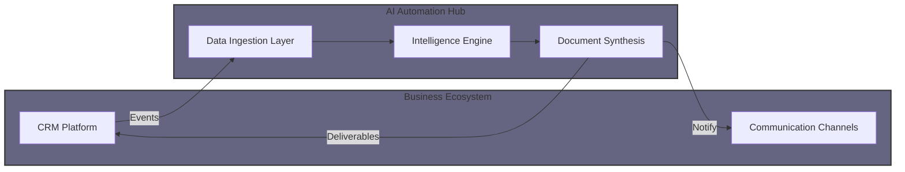

### AI Automation & Integration Engineer | Systems Architect
**Based in Riga, Latvia** 

I specialize in building high-performance autonomous systems that bridge the gap between advanced AI and real-world business processes. Currently focused on architecting production-ready integrations for CRM ecosystems.

---

### What I'm working on right now:
* **High-End CRM Automation:** Developing an intelligent ecosystem for Pipedrive that automates the entire sales lifecycle—from AI-driven lead parsing to dynamic financial document generation (Leasing/VAT).
* **Proprietary AI Logic:** Implementation of two-stage product matching (Fuzzy Search + LLM Selection) to optimize cost and accuracy in large-scale catalogs.
* **Architecture & Reliability:** Building modular, asynchronous FastAPI applications designed for Fault-Tolerant Architecture with comprehensive monitoring (Sentry/Custom Alerts).

---

### Tech Stack & Tools:
* **Backend:** Python (FastAPI, Asyncio, SQLAlchemy)
* **AI/LLM:** OpenAI API (GPT-5.2/5-mini), Prompt Engineering, RAG
* **Databases:** PostgreSQL, Redis
* **DevOps:** Docker & Docker Compose, Linux, Ngrok
* **Tools:** Pipedrive API, WeasyPrint (PDF Gen), Jinja2

---

### System Architecture Focus:
*I believe in clean, documented, and resilient code. Here is a snapshot of my typical integration workflow:*

*(Note: Most of my active commercial development is done in private repositories to protect business logic.)*

---

### Beyond the Code:
* **The "Guarantor of Quality":** I don't just write code; I design systems that solve financial and operational bottlenecks.
* **Speed & Efficiency:** My development process is as fast as my GLE—focused on rapid delivery without compromising the architecture.
* **Networking:** Open for high-stakes AI integration projects and architectural consulting.
